# Goal
Set up the development environment for the DevOps training course...

# Background
An Azure Dev Test Lab VM has been set up for you, log into this VM using the credentials shared with you. This VM is pre set up with the following software;
- Visual Studio 2017 Update 3
- dotNetCore 2.0

# Setup
Follow the below listed steps to set up the pre-req to get PartsUnlimited to work on this pre-provisioned virtual machine...

## Node & Grunt Install 
+ Download [NodeJs](https://nodejs.org/en/download/) for Windows x64
  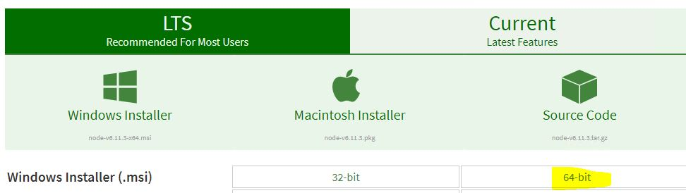
+ Install NodeJs by accepting all the defaults
+ Launch `cmd` and type `PATH`, you should see the following in path ``
  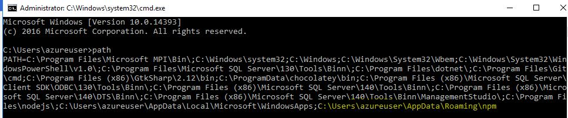
+ Launch `cmd` and type `npm install -g grunt` to install grunt 
  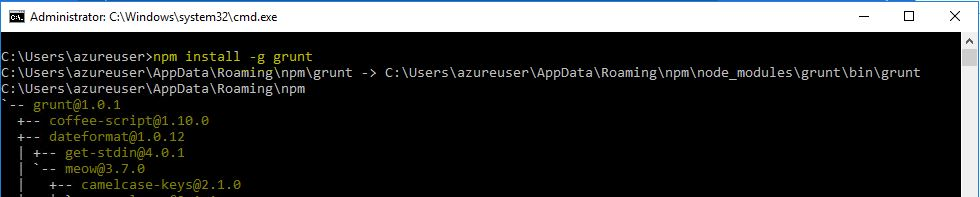
+ Type `npm install -g grunt-cli` to install grunt-cli
  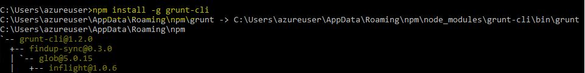
+ To validate the install, launch cmd and type `where grunt`
  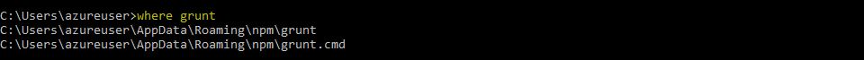
+ To validate if dotnetcore2.0 is installed, launch `cmd` and type `dotnet --version`
  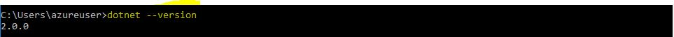     

# Run PartsUnlimited with VisualStudioCode
Parts unlimited has already been cloned on your development virtual machine. To run it with Visual Studio Code follow the instructions below...
+ Launch Visual Studio Code and open the folder `C:\DevOpsTTT\source\repos\PartsUnlimited\src\PartsUnlimitedWebsite`
+ To build the solution in Visual Studio Code click `CTRL + SHIFT + B`. You'll see a prompt to configure a build task...
  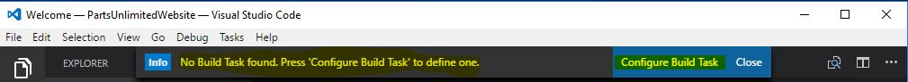
+ Configure dot net core build task, you'll notice a `task.json` gets auto created for you
  
+ `CTRL + SHIFT + B` to trigger a build, it will use this task.json to build the app, you'll be promoted to select the build task to run, choose `Build`
  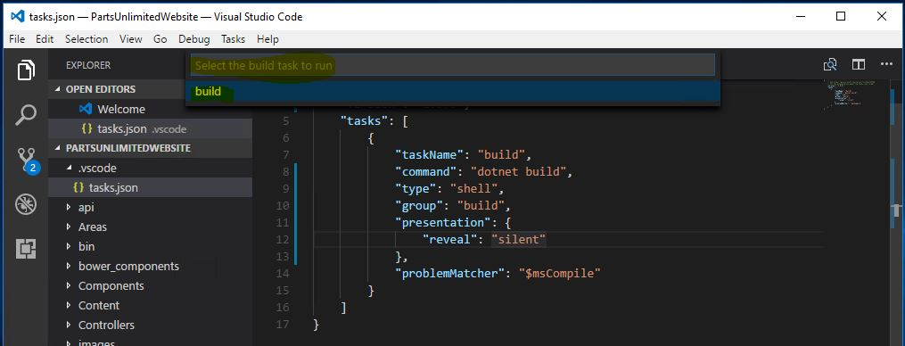
+ Wait for the build to succeed, check the results in the Terminal window 
  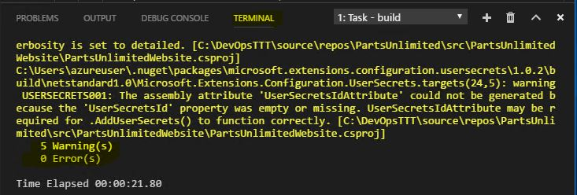
+ To Debug the application, in Visual Studio Code hit `F5`, you'll be promoted to select an `environment`, select more...
  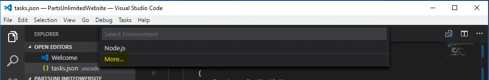
+ Select the debugger `C#` and click install, reload once the install is complete... 
  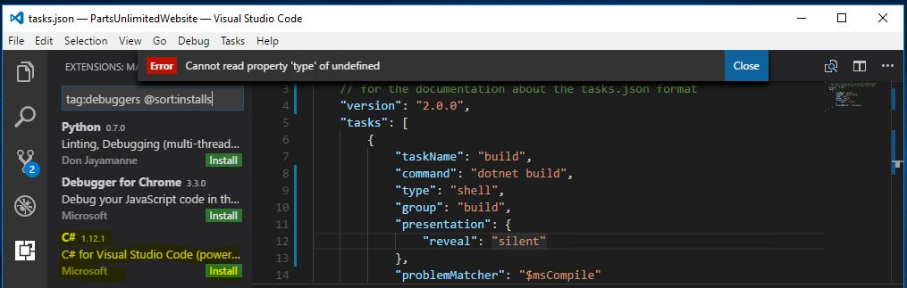
+ Hit `F5` again... You'll see that the packages related to PartsUnlimited start to restore, you'll be promoted to restore missing packages required to compile the solution, accept to add packages...
  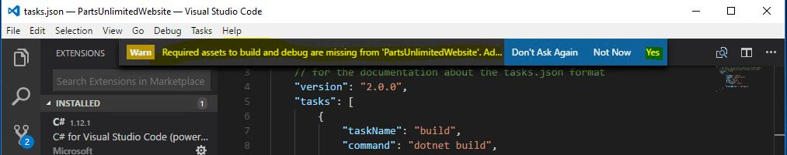
+ Hit `F5` again and you'll be promoted to select the environment, select `dotnetcore`. You might be prompted to auto create a `launch.json` file if it doesn't already exist. If all goes well, you should see the `Parts Unlimited` website launch in debug mode...
  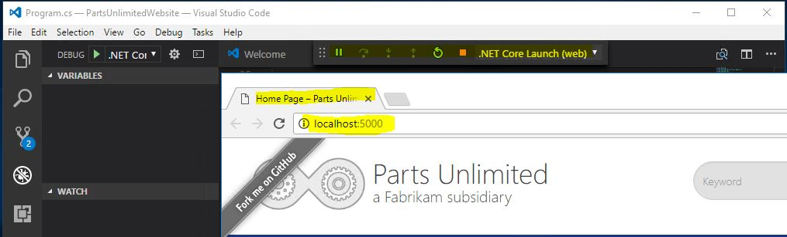